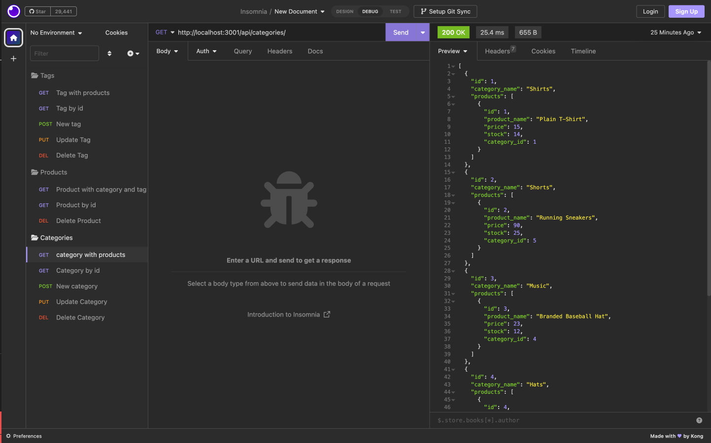
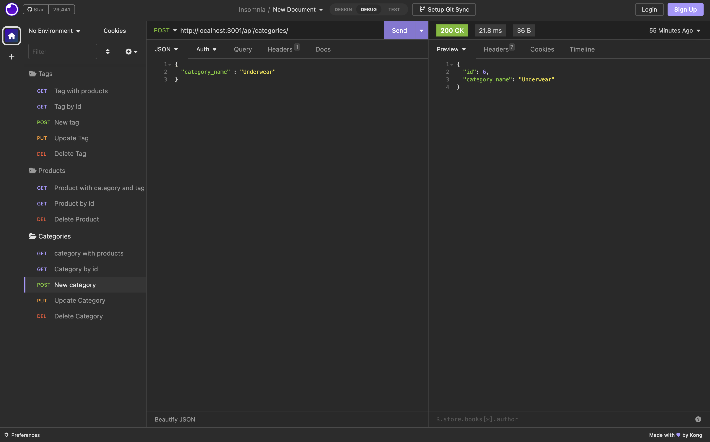

# E-Commerce Back End

## Description

This is a back end for an e-commerce site. It uses Express.js API and Sequelize to interact with a MySQL database. It allows the user to view product categories, products, and associated tags. The user can also add, update, and delete categories, products, and tags. It is seeded with test data. 

## Installation

In order to install the application, the user must clone the repository from GitHub.

## Usage

The user must then install the necessary dependencies by running the following command:npm install. 
The user must then create a .env file in the root directory and add the following to it: DB_NAME='ecommerce_db', DB_USER='root', and DB_PW='password'. The user must then create the database by running the following command: mysql -u root -p and entering the password. The user must then run the following command: source db/schema.sql. The user must then quit MySQL by running the following command: quit. The user must then seed the database by running the following command: npm run seed. The user must then start the server by running the following command: npm start. The user can then test the routes in Insomnia Core.

## Credits

node packages: express, mysql2, sequelize, dotenv

## License

MIT License

## Features

Allows user to view, add, update, and delete categories, products, and tags. 